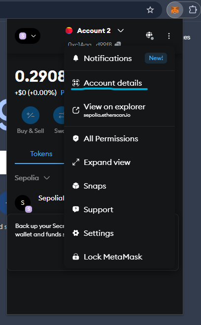
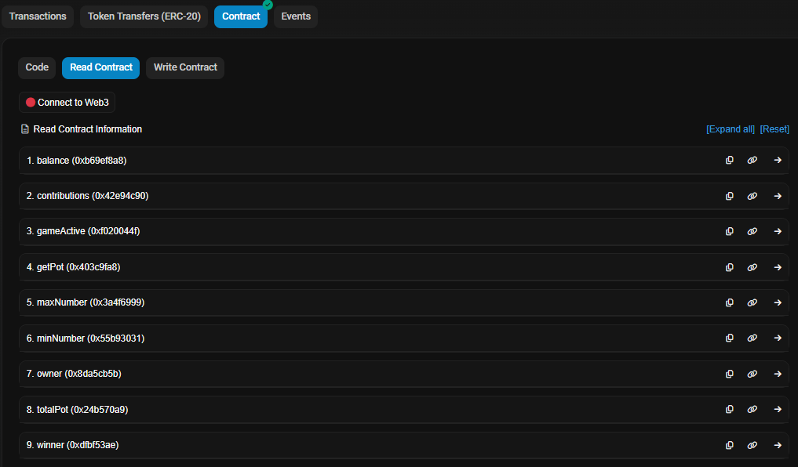

# Web3 Hackathon Hardhat Quick Start! 🚀

Welcome to the **Web3 Hackathon Hardhat Quick Start Guide**! This repository serves as a template to get you up and running with Hardhat for the Web3 hackathon. It provides all the tools you'll need to build, test, and deploy your Ethereum-based smart contracts. 💻🛠️

In this repository, you'll find a simple smart contract that pays out ETH to the person who guess the correct number. Perfect for demonstrating how smart contracts can interact with users and handle basic payouts in a decentralized environment. 💸

**Before we get into it, this workshop is intended to lead into the workshop: "From Zero to dApp: Your First Blockchain Application". It is highly recommended to attend the workshop to maximise your teams chance at success!**

## What is Hardhat? 🧐

**Hardhat** is a development environment for Ethereum software. It helps developers compile, deploy, test, and debug their smart contracts. It includes:

- **Hardhat Network**: A local Ethereum network designed for development & testing.
- **Task Runner**: Automates common development tasks.
- **Plugins**: Extends functionality for deployments, testing, and more.
- **Debugger**: Identifies and fixes issues in smart contracts.

## What’s Inside? 📦

This repository contains:

- **Smart Contract**: A simple contract where users guess a number to win test ETH.
- **Tests**: Automated tests to ensure the contract works as expected.
- **Deployment Script**: A script to deploy the smart contract using Hardhat.

## Getting Started 🏁

### 1. Install Node.js and Hardhat ⚖️

Make sure you have [Node.js](https://nodejs.org/) installed.

### 2. Clone This Repository 💽

Clone this template repository to get started:

```bash
$ git clone https://github.com/ChrisKw0n/web3-workshop-WDCCxUOABC.git
$ cd web3-workshop-WDCCxUOABC
```

### 3. Install Dependencies

Run the following command to install project dependencies:

```bash
$ npm install
```

### 4. Compile the Smart Contract 🏗️

Compile the smart contract to make sure everything is in place:

```bash
$ npx hardhat compile
```

### 5. Run Tests 🧪

Run the automated tests to make sure everything is working correctly:

```bash
$ npx hardhat test
```

## Deploying to the Sepolia Ethereum Testnet!

When using Hardhat, it is best to deploy contracts through a script. To interact with the network, we need a **wallet private key** to send actions from and an **RPC URL** as an access point to the network.

To securely store these details, create a `.env` file in the root directory and initialise the variables:

```bash
SEPOLIA_RPC_URL = <RPC_URL_HERE>
PRIVATE_KEY = <PRIVATE_KEY_HERE>
```

**Note:** Your private key and RPC URL are sensitive details and should NEVER be shared with anyone.

### 1. Get a Wallet Private Key

If you don't have a MetaMask wallet, follow this guide: [Setting up MetaMask](https://support.metamask.io/start/getting-started-with-metamask/).

Find your **private key** in MetaMask under account details and add it to `.env`.

**Watch workshop video for instructions**



### 2. Get an RPC URL for Ethereum Sepolia

Set up an [Alchemy](https://dashboard.alchemy.com/) or [Infura](https://www.infura.io/) app (configured as Eth Sepolia) and copy the network URL. Add it to `.env`.

**Watch workshop video for instructions**


Now you should have the details needed to deploy!

### 3. Deploy the Contract

Run the deployment script:

```bash
$ npx hardhat ignition deploy ./ignition/modules/deploy.ts --network sepolia
```

Once deployed your contract should be live on Ethereum Sepolia, well done! You can view it on [Etherscan Sepolia](https://sepolia.etherscan.io/) using the deployed contract address.

## Interacting with the contract using Etherscan

Since we don't have a front-end that allows us to interact with the deployed smart contract yet, one way to interact with the contract is through Sepolia Etherscan.

**Note:** Etherscan and Sepolia Etherscan are seperate. One is for mainnet (real money) and the other is for Sepolia test network (fake money).

### 1. Get a Sepolia Etherscan api key

[Login/Signup](https://etherscan.io/login) on Etherscan.

Once logged in, head to API Dashboard and "add" an API key. Add this into your `.env` file. (Watch workshop video for demonstration)

Your `.env` file should look like the following:

```bash
SEPOLIA_RPC_URL = <RPC_URL_HERE>
PRIVATE_KEY = <PRIVATE_KEY_HERE>
ETHERSCAN_API_KEY = <API_KEY_HERE>
```

### 2. Deploy and verify your contract

Run this deploy command in cmd:

```bash
$ npx hardhat ignition deploy ./ignition/modules/deploy.ts --network sepolia --verify
```

**Note:** Notice that we have simply added the `--verify` flag at the end of the deploy command.

### 3. Interact with the contract

search for your verified contract on [Sepolia Etherscan](https://sepolia.etherscan.io/). It should now have a green tick on the `contract` tab, indicating successful verification!



As shown above, after `clicking` on the contract tab you will be greeted with 3 sub menus. You can look into `Read Contract` and `Write Contract` for now as they allow for easy interaction with your smart contract.

Watch the workshop video for a demonstration on how this information and menu can be used.

## Conclusion

If you’ve followed these steps, you have successfully initialised, deployed, and interacted with a smart contract on Ethereum Sepolia. Well done! You can expand on this or start your own project using what you have learned so far.

_Feel free to ask questions to mentors or fellow hackers during the hackathon! This is one of the best places to learn so take it step by step._

## Reminder

**This workshop is intended to lead into the workshop: "From Zero to dApp: Your First Blockchain Application". It is highly recommended to attend the workshop to maximise your teams chance at success!**

## Notes:

- Smart contracts can also be written in languages like C++, Rust, or Vyper which are on the niche side for EVM development. Currently Solidity has good backing and support.
